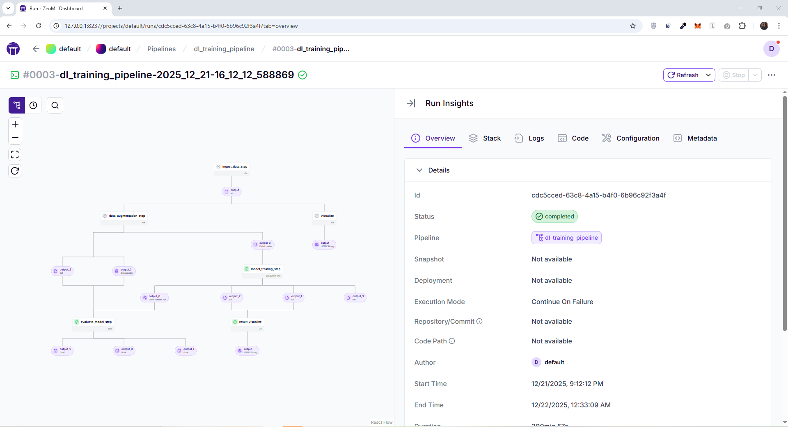

# zenml-deep-learning-pipeline

  

## Overview
**zenml-deep-learning-pipeline** is an end-to-end deep learning project built using **ZenML** to automate the training of **CNN models on MRI datasets** downloaded from **Kaggle**. The pipeline provides a structured and reproducible workflow covering data ingestion, preprocessing, model training, and evaluation.

This project is designed to demonstrate how ZenML can be used for **MLOps-driven deep learning automation**, making experiments scalable, trackable, and easy to reproduce.

## Key Features
- Automated deep learning workflow using ZenML
- CNN-based model training on MRI medical imaging data
- Dataset ingestion from Kaggle
- Modular pipeline steps for easy experimentation
- Reproducible and scalable MLOps-friendly design

## Use Case
- Medical image classification using MRI scans  
- Deep learning experimentation with CNN architectures  
- Learning and implementing ZenML pipelines for automation

## Result

  

## ZenML WorkFLow

  

